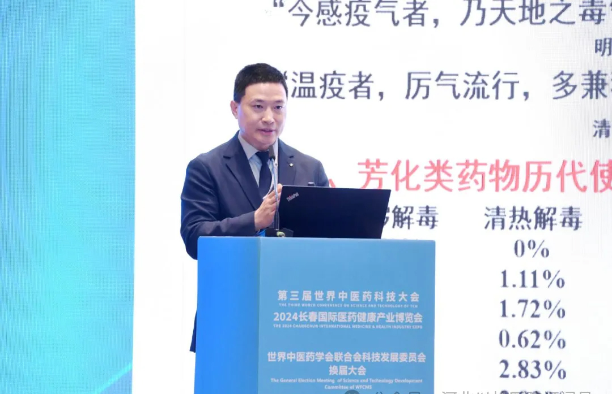
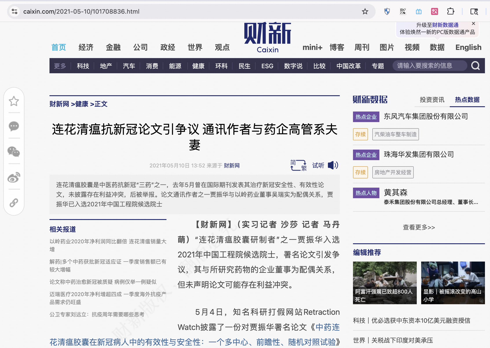
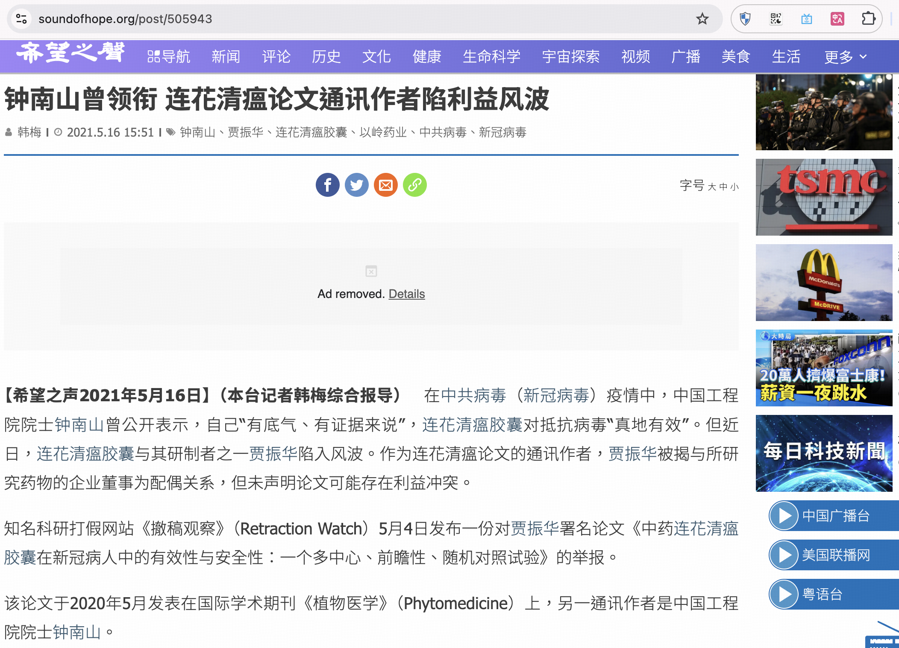
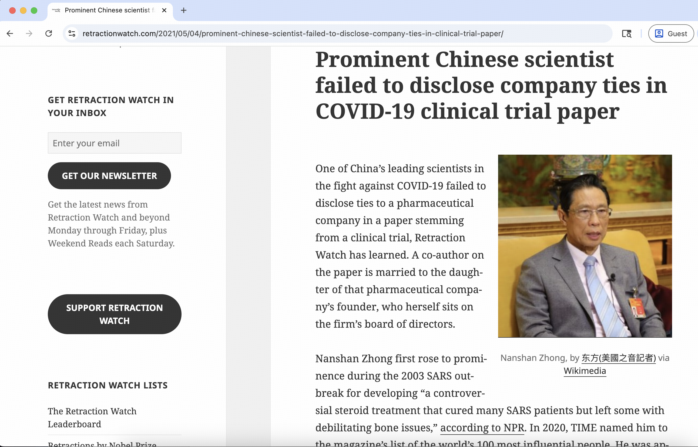

# 贾振华 - 2025年中国工程院院士候选人

## 📋 基本信息

<table>
<tr>
<td width="60%" align="center">

</td>
<td width="40%">

|         **项目**          |            **内容**             |
|:-----------------------:|:-----------------------------:|
|         **姓名**          |              贾振华              |
|        **任职单位**         |         石家庄以岭药业股份有限公司         |
|         **评选**          |         2025年中国工程院院士          |
|      **负面舆情评估总分**       |             -5 分              |
|       **负面舆情排名**        |              10               |
| **可信度 （含实名举报/官方处分）** |              ✅ 是              |
|        **学术不端**         |          -5 分 🔴 严重           |
|        **师风师德**         |              0 分              |
|        **经济腐败**         |              0 分              |
|       **负面舆情总结**        | 在”莲花清瘟“临床试验论文中故意隐瞒夫妻利益冲突  |

</td>
</tr>
</table>

---

## 🔭 舆情总结

贾振华作为2025年中国工程院院士候选人，在网络舆情中存在重大学术诚信争议。主要问题集中在学术不端方面：

| 问题类别 | 评分 | 严重程度  |
|:---:|:---:|:-----:|
| 学术不端 | -5 | 🔴 严重 |
| 师风师德 | 0 |  无问题  |
| 经济腐败 | 0 |  无问题  |

---

### 📚 学术不端问题

|       项目       | 详情                                       |
|:--------------:|:-----------------------------------------|
| **评分（满分 -5分）** | -5 分                                      |
|     **总结**     | 论文未披露重大利益冲突，涉嫌学术不诚信                     |
|     **详情**     | 《撤稿观察》（Retraction Watch）披露，贾振华在连花清瘟新冠临床试验论文中未披露与制药公司石家庄以岭药业的利益关系。贾振华与该公司董事吴瑞为夫妻关系，但在论文利益声明中标注为"没有"利益冲突。2020年8月有匿名举报人向《植物医学》期刊举报此利益冲突问题，期刊主编要求贾振华回应并提供勘误草稿。这种故意隐瞒利益关系的行为严重违反了学术诚信准则。 |

### 👥 师风师德问题

|       项目       | 详情                                       |
|:--------------:|:-----------------------------------------|
| **评分（满分 -5分）** | 0 分                                      |
|     **总结**     | 无相关负面信息                     |
|     **详情**     | 暂无师风师德方面的负面报道 |

### 💰 经济腐败问题

|       项目       | 详情                                       |
|:--------------:|:-----------------------------------------|
| **评分（满分 -5分）** | 0 分                                      |
|     **总结**     | 无相关负面信息                     |
|     **详情**     | 暂无经济腐败方面的负面报道 |

---

## 📎 证据材料

### 图片证据

#### 证据1 

#### 证据2

#### 证据3 

### 信息来源:

1. 🔗 [财新网相关报道](https://www.caixin.com/2021-05-10/101708836.html)
2. 🔗 [希望之声报道](https://www.soundofhope.org/post/505943)
3. 🔗 [Retraction Watch报道](https://retractionwatch.com/2021/05/04/prominent-chinese-scientist-failed-to-disclose-company-ties-in-clinical-trial-paper)
 
---

## 提示

> 
> 1. 本文档所有信息均来自互联网公开资料
> 2. 内容仅供参考，不代表任何官方立场
> 3. 如有错误或补充，请联系：topscifuture@outlook.com
> 4. 本文档不构成对任何个人的诽谤或人身攻击
> 5. 最终评选结果以官方公布为准