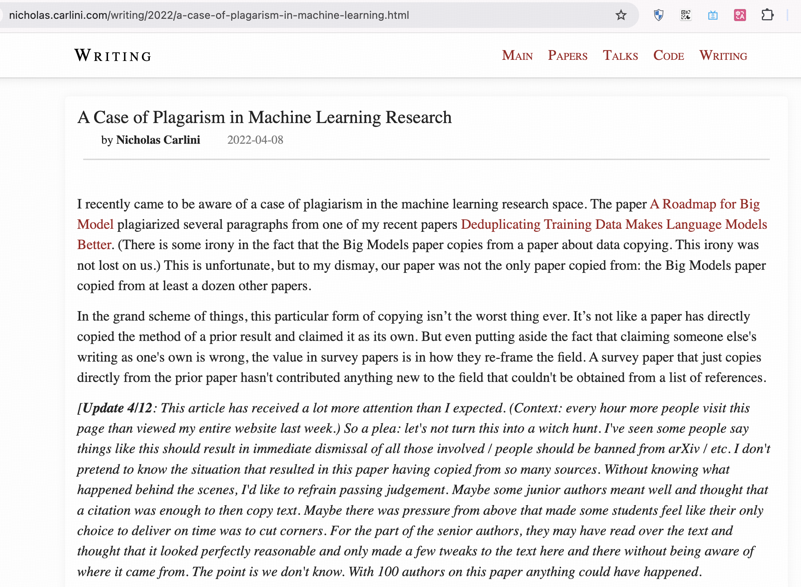
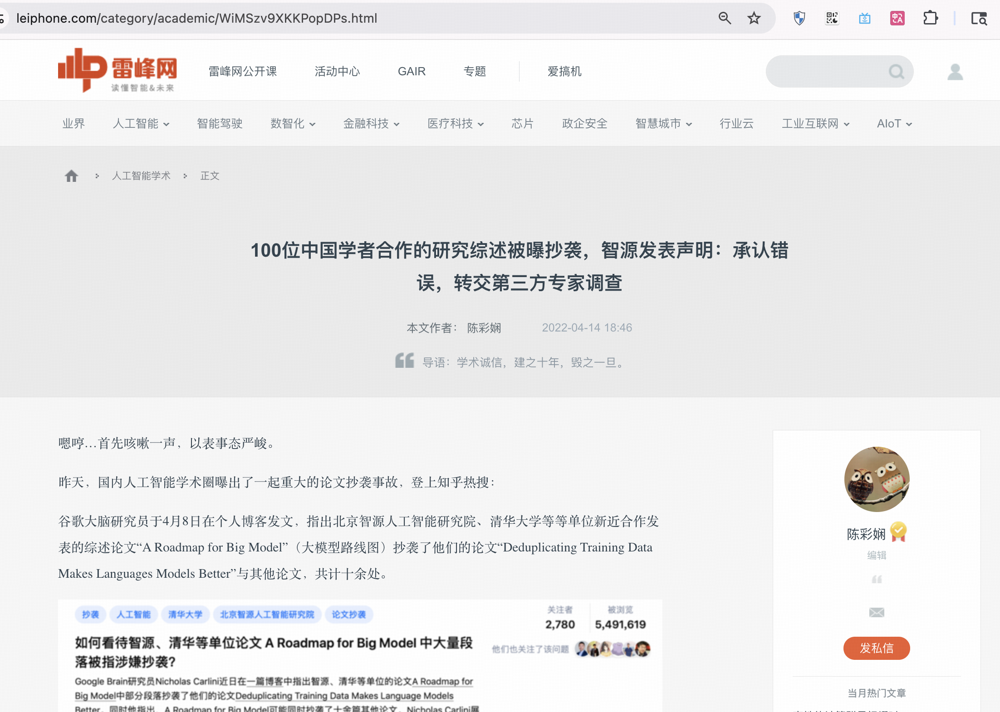
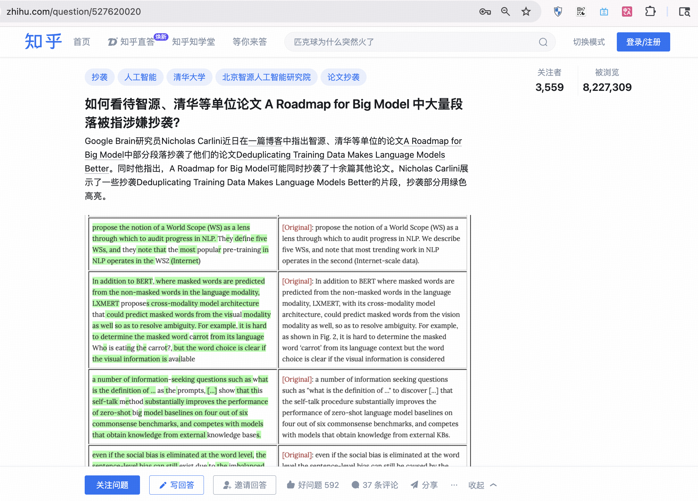

# 唐杰 - 2025年中国工程院院士候选人

## 📋 基本信息

<table>
<tr>
<td width="60%" align="center">

</td>
<td width="40%">

|         **项目**          |    **内容**    |
|:-----------------------:|:------------:|
|         **姓名**          |      唐杰      |
|        **任职单位**         |     清华大学     |
|         **评选**          | 2025年中国工程院院士 |
|      **负面舆情评估总分**       |     -5 分     |
|       **负面舆情排名**        |      9       |
| **可信度 （含实名举报/官方处分）** |     ✅ 是      |
|        **学术不端**         |  -5 分 🔴 严重  |
|        **师风师德**         |     0 分      |
|        **经济腐败**         |     0 分      |
|       **负面舆情总结**        | "论文搬运工“，论文严重抄袭  |

</td>
</tr>
</table>

---

## 🔭 舆情总结

唐杰作为2025年中国工程院院士候选人，在网络舆情中存在较大争议。主要问题集中在学术不端方面：

| 问题类别 | 评分 | 严重程度  |
|:---:|:---:|:-----:|
| 学术不端 | -5 | 🔴 严重 |
| 师风师德 | 0 |   无   |
| 经济腐败 | 0 |   无   |

---

### 📚 学术不端问题

|       项目       | 详情                                       |
|:--------------:|:-----------------------------------------|
| **评分（满分 -5分）** | -5 分                                      |
|     **总结**     | 抄袭国外学者论文                                 |
|     **详情**     | 根据网上资料，2022年4月有报道称，由唐杰牵头的论文《A Roadmap for Big Model》被Google Brain的一名研究员指出严重抄袭。该论文涉及来自清华、北大、上海交大等十多家知名机构的数十名国内AI大牛参与署名。 |

### 👥 师风师德问题

|       项目       | 详情                                       |
|:--------------:|:-----------------------------------------|
| **评分（满分 -5分）** | 0 分                                      |
|     **总结**     | 无                                       |
|     **详情**     | 无                                       |

### 💰 经济腐败问题

|       项目       | 详情                                       |
|:--------------:|:-----------------------------------------|
| **评分（满分 -5分）** | 0 分                                      |
|     **总结**     | 无                                       |
|     **详情**     | 无                                       |

---

## 📎 证据材料

### 图片证据

#### 证据1 

#### 证据2

#### 证据3 

### 信息来源:

1. 🔗 [Google Brain研究员揭露抄袭事件原文](https://nicholas.carlini.com/writing/2022/a-case-of-plagarism-in-machine-learning.html)
2. 🔗 [相关报道分析](https://www.leiphone.com/category/academic/WiMSzv9XKKPopDPs.html)
3. 🔗 [知乎讨论](https://www.zhihu.com/question/527620020)
 
---

## 提示

> 
> 1. 本文档所有信息均来自互联网公开资料
> 2. 内容仅供参考，不代表任何官方立场
> 3. 如有错误或补充，请联系：topscifuture@outlook.com
> 4. 本文档不构成对任何个人的诽谤或人身攻击
> 5. 最终评选结果以官方公布为准