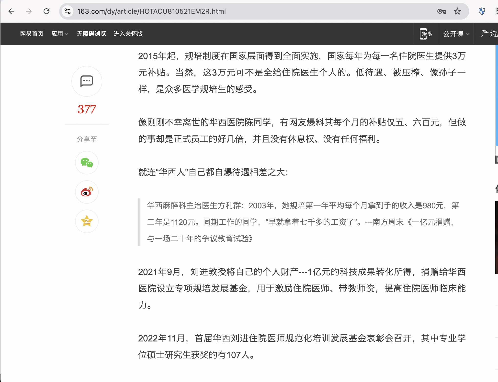
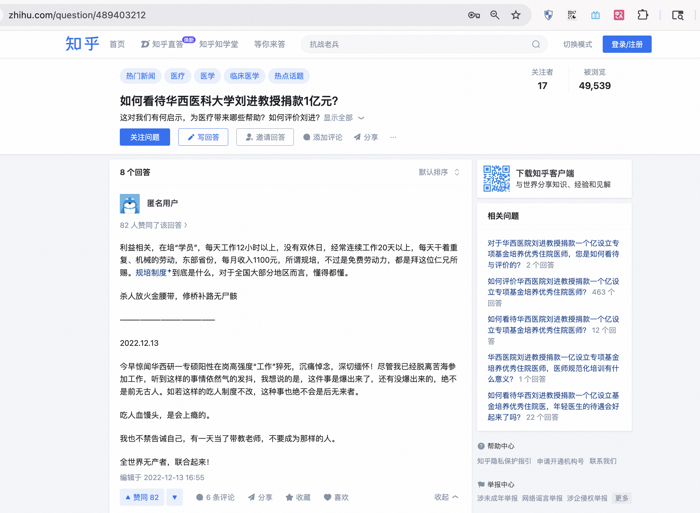
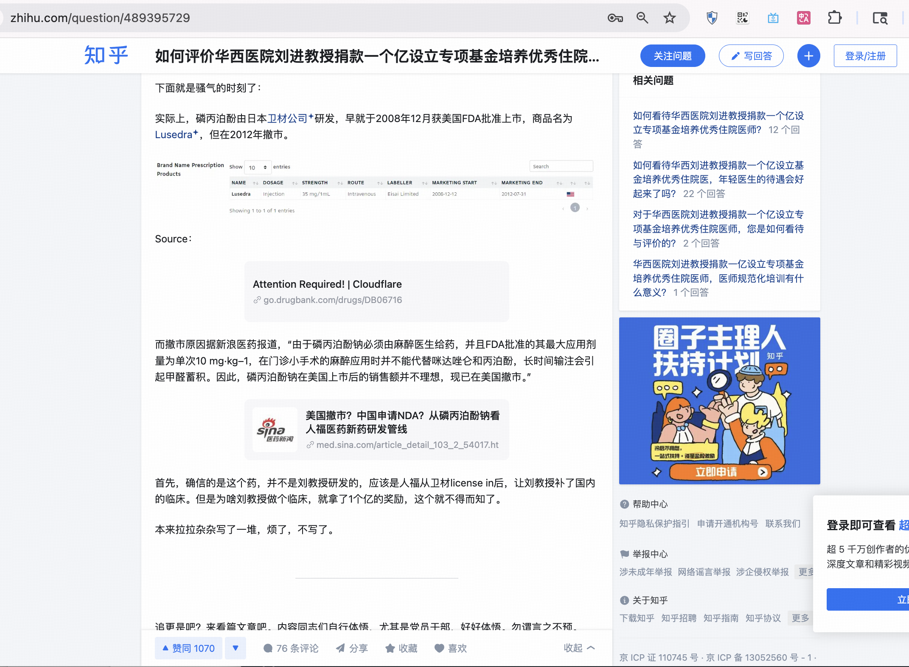

# 刘进 - 2025年中国工程院院士候选人

## 📋 基本信息

<table>
<tr>
<td width="60%" align="center">

</td>
<td width="40%">

|         **项目**          |            **内容**             |
|:-----------------------:|:-----------------------------:|
|         **姓名**          |              刘进               |
|        **任职单位**         |           四川大学华西医院            |
|         **评选**          |         2025年中国工程院院士          |
|      **负面舆情评估总分**       |             -5 分              |
|       **负面舆情排名**        |              12               |
| **可信度 （含实名举报/官方处分）** |              ❌ 否              |
|        **学术不端**         |              0 分              |
|        **师风师德**         |          -5 分 🔴 严重           |
|        **经济腐败**         |              0 分              |
|       **负面舆情总结**        | "当代血汗工厂“，剥削规培生，压榨学生做"免费"劳动力   |

</td>
</tr>
</table>

---

## 🔭 舆情总结

刘进作为2025年中国工程院院士候选人，在网络舆情中存在较大争议。主要问题集中在以下三个方面：

| 问题类别 | 评分 | 严重程度  |
|:---:|:---:|:-----:|
| 学术不端 | 0 |   无   |
| 师风师德 | -5 | 🔴 严重 |
| 经济腐败 | 0 |   无   |

---

### 📚 学术不端问题

|       项目       | 详情                                       |
|:--------------:|:-----------------------------------------|
| **评分（满分 -5分）** | 0 分                                      |
|     **总结**     | 无                     |
|     **详情**     | 无 |

### 👥 师风师德问题

|       项目       | 详情                                       |
|:--------------:|:-----------------------------------------|
| **评分（满分 -5分）** | -5 分                                      |
|     **总结**     | 剥削规培生，压榨学生做"免费劳动力"                     |
|     **详情**     | 知乎上有规培学员反映每天工作12小时以上，没有双休日，经常连续工作20天以上，每月收入仅1100元，称规培制度是"免费劳动力"。网友批评称"捐款彻底暴露出了规培的剥削本质，因为活都被给规培生做了，所以刘主任才有时间去科研攻关"，有人说这是"在用规培生的鲜血染红自己的红顶子"。有人称华西医院为"规培的发源地，吸血的魔窟"。 |

### 💰 经济腐败问题

|       项目       | 详情                                       |
|:--------------:|:-----------------------------------------|
| **评分（满分 -5分）** | 0 分                                      |
|     **总结**     | 无                     |
|     **详情**     | 无 |

---

## 📎 证据材料

### 图片证据

#### 证据1 

#### 证据2

#### 证据3 

#### 证据4 

### 信息来源:

1. 🔗 [知乎1](https://www.zhihu.com/question/489953596)
2. 🔗 [知乎2](https://www.zhihu.com/question/489403212)
3. 🔗 [知乎3](https://www.zhihu.com/question/489395729)
4. 🔗 [网易新闻报道](https://www.163.com/dy/article/HOTACU810521EM2R.html)
 
---

## 提示

> 
> 1. 本文档所有信息均来自互联网公开资料
> 2. 内容仅供参考，不代表任何官方立场
> 3. 如有错误或补充，请联系：topscifuture@outlook.com
> 4. 本文档不构成对任何个人的诽谤或人身攻击
> 5. 最终评选结果以官方公布为准