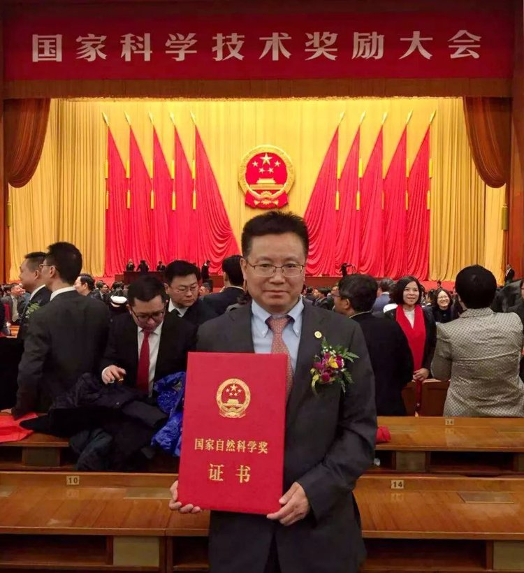
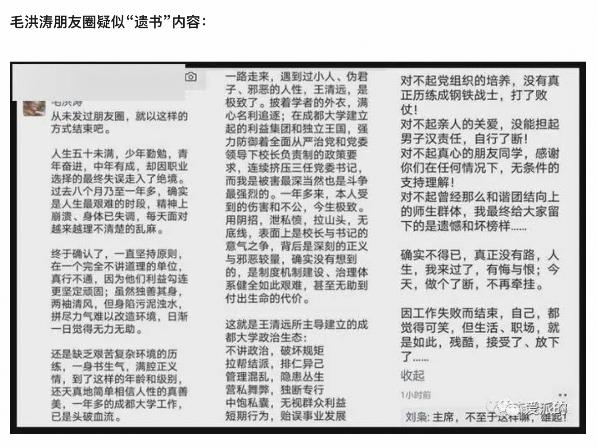
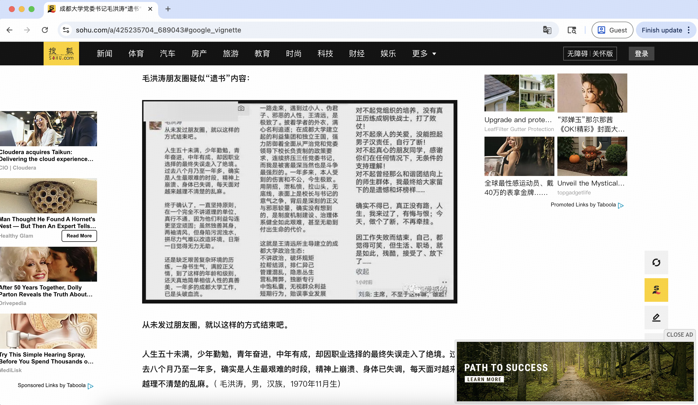
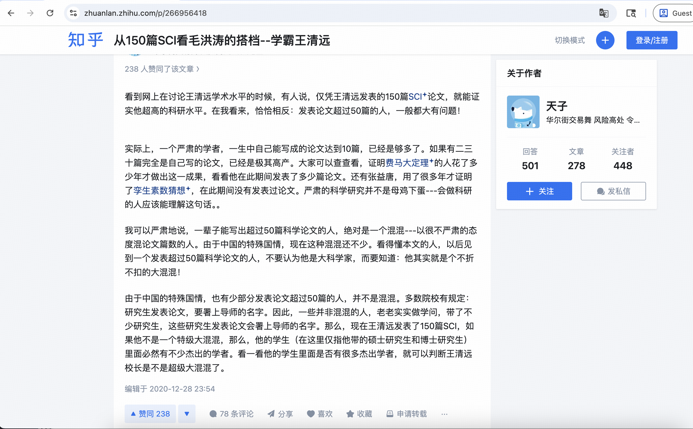
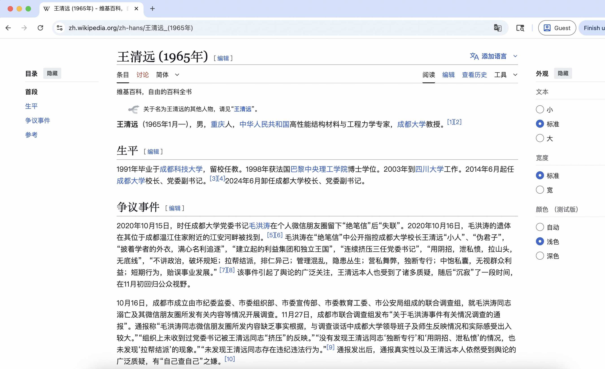

# 王清远 - 2025年中国科学院士候选人

## 📋 基本信息

<table>
<tr>
<td width="60%" align="center">

</td>
<td width="40%">

|         **项目**          |         **内容**          |
|:-----------------------:|:-----------------------:|
|         **姓名**          |           王清远           |
|        **任职单位**         |          四川大学           |
|         **评选**          |      2025年中国科学院院士       |
|      **负面舆情评估总分**       |          -11 分          |
|       **负面舆情排名**        |            1            |
| **可信度 （含实名举报/官方处分）** |           ✅ 是           |
|        **学术不端**         |       -2 分 🟡 中等        |
|        **师风师德**         |       -5 分 🔴 严重        |
|        **经济腐败**         |       -4 分 🔴 严重        |
|       **负面舆情总结**        | 毛洪涛"遗书"实名指控王清远，"中饱私囊,追名逐利",真"小人"  |

</td>
</tr>
</table>

## 🔭 舆情总结

王清远作为2025年中国科学院院士候选人，在网络舆情中存在较大争议。主要问题集中在以下三个方面：

| 问题类别 | 评分 | 严重程度 |
|:---:|:---:|:---:|
| 学术不端 | -2 | 🟡 中等 |
| 师风师德 | -5 | 🔴 严重 |
| 经济腐败 | -4 | 🔴 严重 |

---

### 📚 学术不端问题

|       项目       | 详情 |
|:--------------:|:---|
| **评分（满分 -5分）** | -2 分 |
|     **总结**     | 灌水论文过多，涉嫌夺取学生第一署名权 |
|     **详情**     | 有网友质疑王清远发表论文数量过多，认为"发表论文超过50篇的人，一般都大有问题"，认为"一个严肃的学者，一生中自己能写成的论文达到10篇，已经是够多了"。  有人质疑其"既当官又做这么多不同课题的数百个科学研究"的能力，认为可能存在"很多他的学生下属，辛辛苦苦做了大量工作，结果被夺去了第一署名权"的情况。 |

### 👥 师风师德问题

|       项目       | 详情                                                                                                                                                                                                                                     |
|:--------------:|:---------------------------------------------------------------------------------------------------------------------------------------------------------------------------------------------------------------------------------------|
| **评分（满分 -5分）** | -5 分                                                                                                                                                                                                                                   |
|     **总结**     | 毛洪涛”绝笔信“指控王清远人品低劣，"拉帮结派、排仁异己、独断专行"，真”小人“                                                                                                                                                                                               |
|     **详情**     | 2020年10月，成都大学党委书记毛洪涛在""绝笔信""中公开指控成都大学校长王清远为"小人"、"伪君子"，"披着学者的外衣，满心名利追逐"，"建立起的利益集团和独立王国"，"连续挤压三任党委书记"，""用阴招，泄私愤，拉山头，无底线""。  毛洪涛指控王清远""不讲政治，破坏规矩；拉帮结派，排仁异己；管理混乱，隐患丛生；营私舞弊，独断专行；中饱私囊，无视群众利益；短期行为，贻误事业发展。""在毛洪涛遗体告别仪式上，王清远未到场，引发舆论热议。 |

### 💰 经济腐败问题

|       项目       | 详情                                                                                    |
|:--------------:|:--------------------------------------------------------------------------------------|
| **评分（满分 -5分）** | -4 分                                                                                  |
|     **总结**     | 利益至上，中饱私囊                                                                             |
|     **详情**     | 毛洪涛在绝笔信中指控王清远"中饱私囊，无视群众利益"。    毛洪涛指控成都大学王清远团伙涉嫌集体腐败，描述为"利益集团、独立王国"，"营私舞弊，独断专行"。 |

---

## 📎 证据材料

### 图片证据

#### 证据1 

#### 证据2

#### 证据3 

#### 证据4 

### 信息来源:

1. 🔗 [搜狐网相关报道](https://www.sohu.com/a/425235704_689043#google_vignette)
2. 🔗 [知乎专栏分析文章](https://zhuanlan.zhihu.com/p/266956418)
3. 🔗 [维基百科 - 王清远_(1965年)](https://zh.wikipedia.org/zh-hans/王清远_(1965年))

---

## 提示

> 
> 1. 本文档所有信息均来自互联网公开资料
> 2. 内容仅供参考，不代表任何官方立场
> 3. 如有错误或补充，请联系：topscifuture@outlook.com
> 4. 本文档不构成对任何个人的诽谤或人身攻击
> 5. 最终评选结果以官方公布为准
