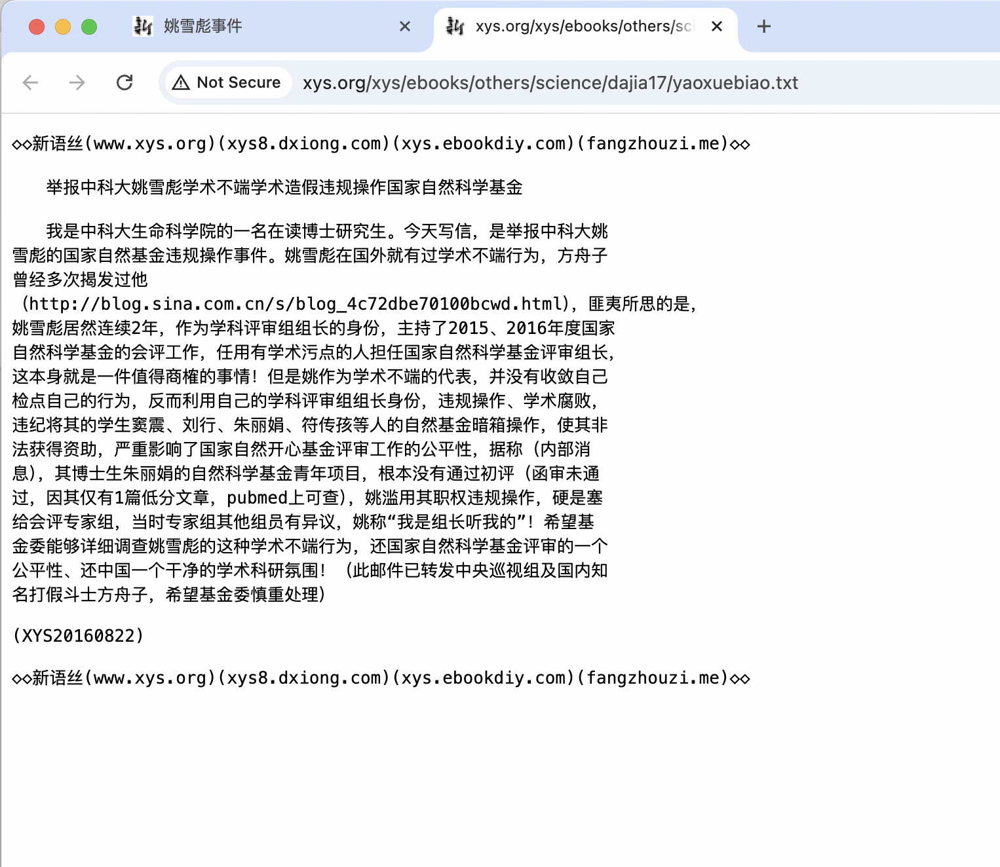

# 姚雪彪 - 2025年中国科学院院士候选人

## 📋 基本信息

<table>
<tr>
<td width="60%" align="center">

</td>
<td width="40%">

|         **项目**          |                  **内容**                |
|:-----------------------:|:--------------------------------------:|
|         **姓名**          |                   姚雪彪                  |
|        **任职单位**         |                 中国科学技术大学               |
|         **评选**          |               2025年中国科学院院士             |
|      **负面舆情评估总分**       |                  -11 分                 |
|       **负面舆情排名**        |                    2                   |
| **可信度 （含实名举报/官方处分）** |                   ✅ 是                  |
|        **学术不端**         |                -4 分 🔴 严重              |
|        **师风师德**         |                -5 分 🔴 严重              |
|        **经济腐败**         |                -2 分 🟡 中等              |
|       **负面舆情总结**        | "人品低劣"，蓄意破坏同事的实验样品，被学校开除；违规操纵国家自然科学基金 |

</td>
</tr>
</table>

---

## 🔭 舆情总结

姚雪彪作为2025年中国科学院院士候选人，在网络舆情中存在较大争议。主要问题集中在以下三个方面：

| 问题类别 | 评分 | 严重程度 |
|:---:|:---:|:---:|
| 学术不端 | -4 | 🔴 严重 |
| 师风师德 | -5 | 🔴 严重 |
| 经济腐败 | -2 | 🟡 中等 |

---

### 📚 学术不端问题

|       项目       | 详情                                                                       |
|:--------------:|:-------------------------------------------------------------------------|
| **评分（满分 -5分）** | -4 分                                                                     |
|     **总结**     | 学术造假，违规操作                                                                |
|     **详情**     | 网上有举报称姚雪彪存在学术不端学术造假违规操作国家自然科学基金。方舟子的新语丝网站专门设有"姚雪彪事件"专栏，多次发表文章质疑姚雪彪的学术问题。 |

### 👥 师风师德问题

|       项目       | 详情                                       |
|:--------------:|:-----------------------------------------|
| **评分（满分 -5分）** | -5 分                                      |
|     **总结**     | 蓄意破坏同事的实验样品，性质恶劣，被学校开除             |
|     **详情**     | 1998年下半年，在威斯康星大学麦迪逊分校期间，同事查普曼的实验不断出现意外，包括设备温度被调高、培养皿中被倒入漂白剂、盐等，试管烧瓶标签被调换。录像带显示姚雪彪曾出现在仪器室，拿起查普曼学生的试管看了看又放回去。1998年，他曾被指控在威斯康星大学麦迪逊分校蓄意破坏他人的实验样品，并遭开除。 |

### 💰 经济腐败问题

|       项目       | 详情                                       |
|:--------------:|:-----------------------------------------|
| **评分（满分 -5分）** | -2 分                                      |
|     **总结**     | 违规操纵国家自然科学基金                         |
|     **详情**     | 有举报称姚雪彪违规操作国家自然科学基金。 |

---

## 📎 证据材料

### 图片证据

#### 证据1 

#### 证据2

#### 证据3 

#### 证据4 

### 信息来源:

1. 🔗 [新语丝-姚雪彪事件专栏](http://xys.org/dajia/yaoxuebiao.html)
2. 🔗 [百度百科-姚雪彪（因近期百度百科被编辑，内容消失）](https://baike.baidu.com/item/姚雪彪/7952698)
 
---

## 提示

> 
> 1. 本文档所有信息均来自互联网公开资料
> 2. 内容仅供参考，不代表任何官方立场
> 3. 如有错误或补充，请联系：topscifuture@outlook.com
> 4. 本文档不构成对任何个人的诽谤或人身攻击
> 5. 最终评选结果以官方公布为准