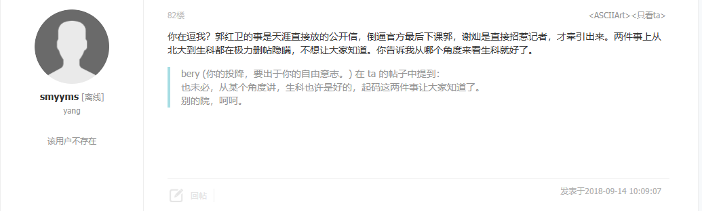

# 郭红卫 - 2025年中国科学院院士候选人

## 📋 基本信息

<table>
<tr>
<td width="70%" align="center">

</td>
<td width="30%">

|         **项目**          |               **内容**                |
|:-----------------------:|:-----------------------------------:|
|         **姓名**          |                 郭红卫                 |
|        **任职单位**         |               南方科技大学                |
|         **评选**          |            2025年中国科学院院士             |
|      **负面舆情评估总分**       |                -10 分                |
|       **负面舆情排名**        |                  3                  |
| **可信度 （含实名举报/官方处分）** |                 ✅ 是                 |
|        **学术不端**         |                 0 分                 |
|        **师风师德**         |             -5 分 🔴 严重              |
|        **经济腐败**         |             -5 分 🔴 严重              |
|       **负面舆情总结**        | 出轨实验室本科生，挪用科研经费用于酒店开房，被撤销北大副院长和报请取消教师资格 |

</td>
</tr>
</table>

---

## 🔭 舆情总结

郭红卫作为2025年中国科学院院士候选人，在网络舆情中存在较大争议。主要问题集中在以下三个方面：

| 问题类别 | 评分 | 严重程度 |
|:---:|:---:|:---:|
| 学术不端 | 0 | ✅ 无 |
| 师风师德 | -5 | 🔴 严重 |
| 经济腐败 | -5 | 🔴 严重 |

---

### 📚 学术不端问题

|       项目       | 详情                                       |
|:--------------:|:-----------------------------------------|
| **评分（满分 -5分）** | 0 分                                      |
|     **总结**     | 无                     |
|     **详情**     | 无 |

### 👥 师风师德问题

|       项目       | 详情                                       |
|:--------------:|:-----------------------------------------|
| **评分（满分 -5分）** | -5 分                                      |
|     **总结**     | 出轨本科实习生，被撤销北大副院长和高校教师资格                     |
|     **详情**     | 网络上存在一份实名举报材料，指控郭红卫教授与北京大学生命科学学院本科生发生不正当关系，声称在学生进行本科生科研期间多次受到引诱并发生性关系。这份举报材料提到了违反教育部2014年关于高校师德建设的相关规定。北京大学纪委监察室经调查，免去郭红卫生命科学学院副院长职务，撤销郭红卫教师职务，报请北京市教委撤销其高等学校教师资格。 |

### 💰 经济腐败问题

|       项目       | 详情                                       |
|:--------------:|:-----------------------------------------|
| **评分（满分 -5分）** | -5 分                                      |
|     **总结**     | 挪用科研经费用于酒店开房                     |
|     **详情**     | 在前述举报材料中提及，据受害人反映，郭红卫酒店费用均出于其科研经费。涉嫌挪用科研经费，免除北大副院长以及教师资格。 |

---

## 📎 证据材料

### 图片证据

#### 证据1 

#### 证据2

#### 证据3 

#### 证据4 

### 信息来源:

1. 🔗 [天涯社区相关报道](https://tianya.cv/thread/0/12539835/1.html)
2. 🔗 [知乎分析文章](https://www.zhihu.com/question/38901048)
3. 🔗 [百科文库](https://www.bkwk.cn/article/jmbdghwsjsnxzxyllzy-a19893972.html)
4. 🔗 [新浪博客](https://blog.sina.com.cn/s/blog_637716960102wmax.html)
 
---

## 提示

> 
> 1. 本文档所有信息均来自互联网公开资料
> 2. 内容仅供参考，不代表任何官方立场
> 3. 如有错误或补充，请联系：topscifuture@outlook.com
> 4. 本文档不构成对任何个人的诽谤或人身攻击
> 5. 最终评选结果以官方公布为准