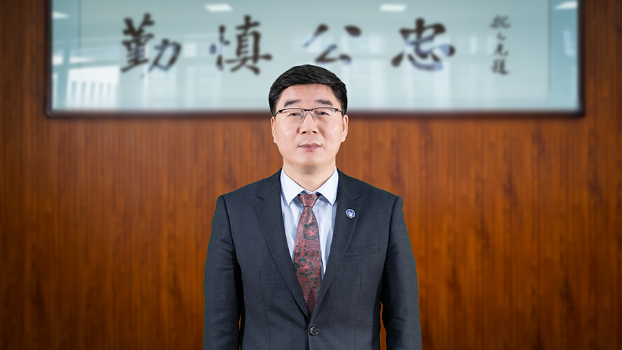
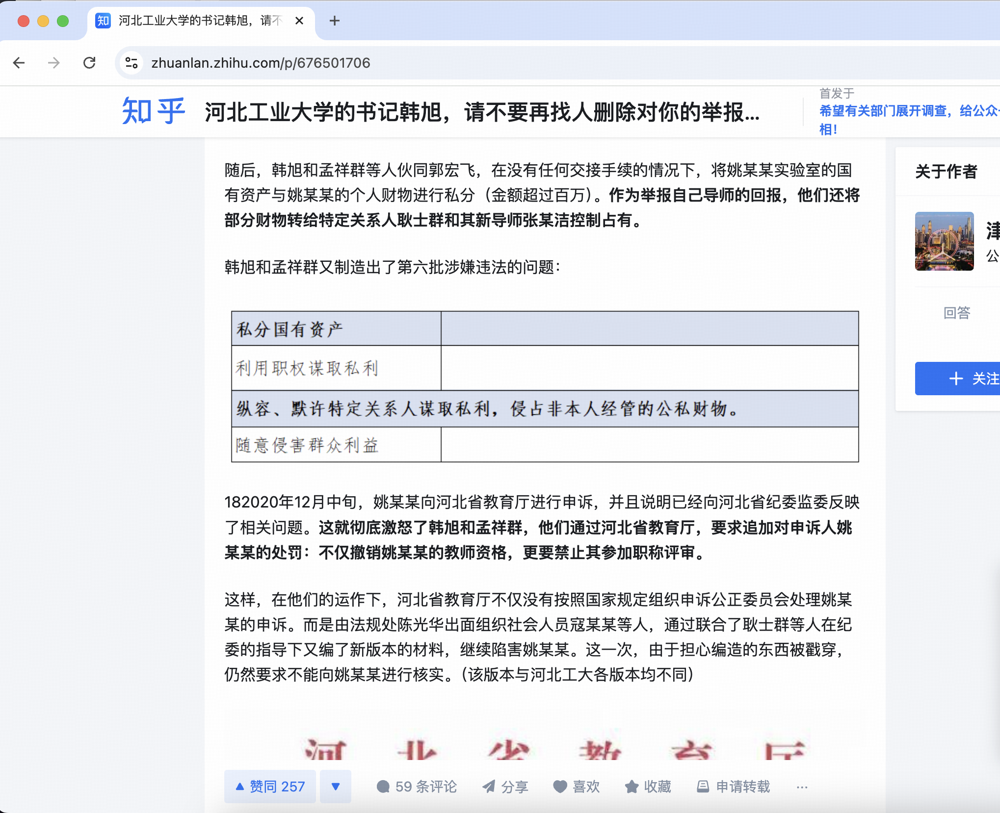
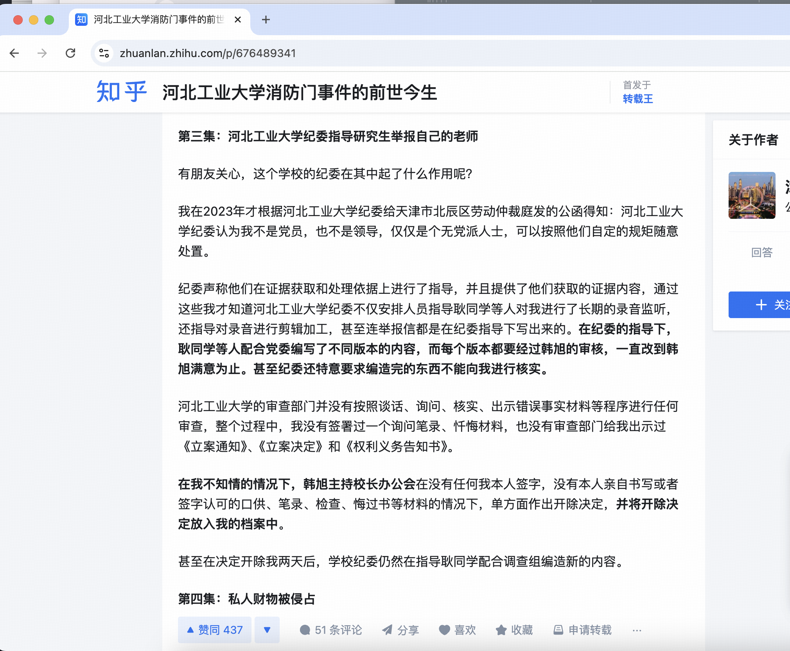
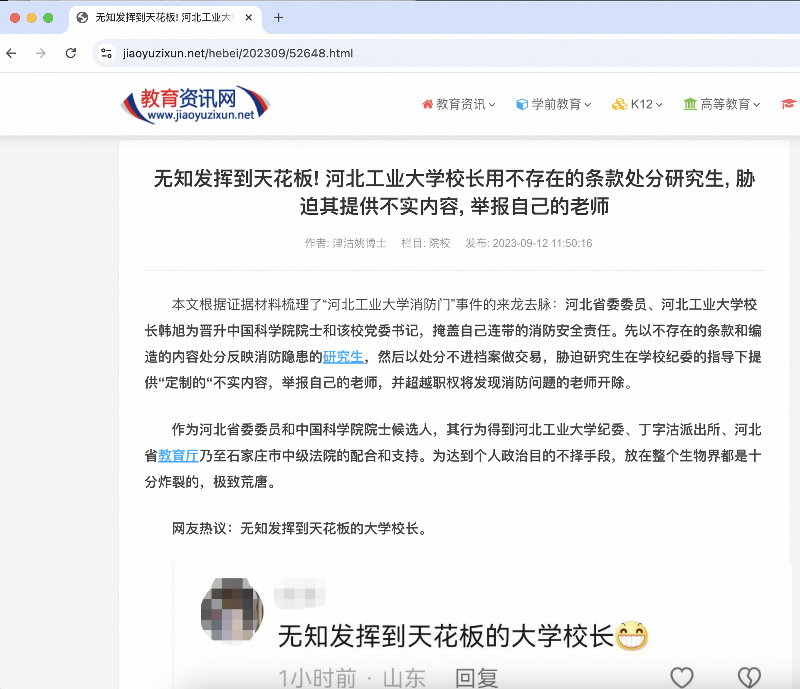
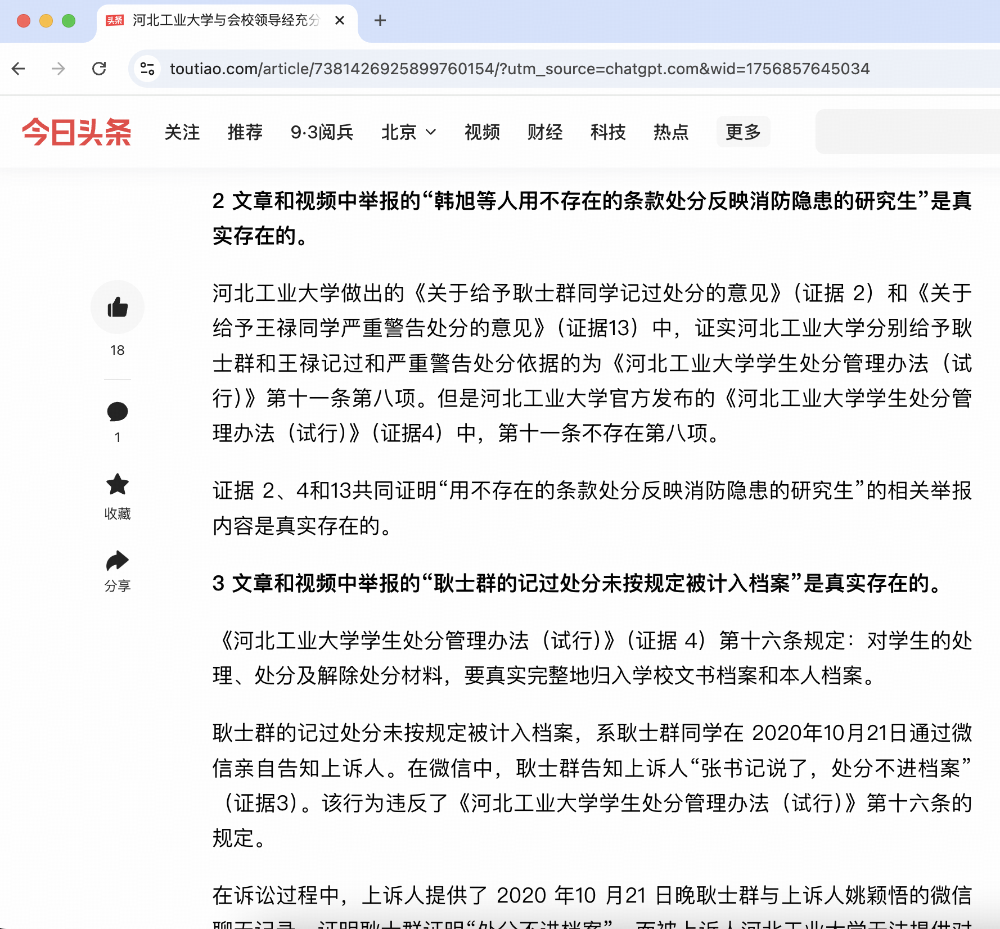
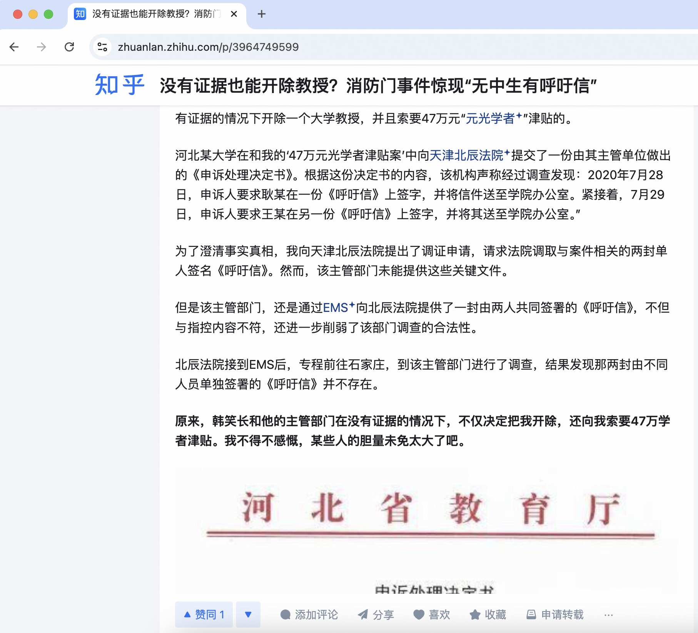

# 韩旭 - 2025年中国科学院院士候选人

## 📋 基本信息

<table>
<tr>
<td width="60%" align="center">

</td>
<td width="40%">

|         **项目**          |              **内容**              |
|:-----------------------:|:--------------------------------:|
|         **姓名**          |                韩旭                |
|        **任职单位**         |              河北工业大学              |
|         **评选**          |           2025年中国科学院院士           |
|      **负面舆情评估总分**       |              -10 分               |
|       **负面舆情排名**        |                4                 |
| **可信度 （含实名举报/官方处分）** |               ✅ 是                |
|        **学术不端**         |               0 分                |
|        **师风师德**         |            -5 分 🔴 严重            |
|        **经济腐败**         |            -5 分 🔴 严重            |
|       **负面舆情总结**        | 陷害老师，干涉司法公正，销毁举报材料；私分国有资产，侵占他人财物 |

</td>
</tr>
</table>

---

## 🔭 舆情总结

韩旭作为2025年中国科学院院士候选人，在网络舆情中存在较大争议。主要问题集中在以下三个方面：

| 问题类别 | 评分 | 严重程度  |
|:---:|:---:|:-----:|
| 学术不端 | 0 |   无   |
| 师风师德 | -5 | 🔴 严重 |
| 经济腐败 | -5 | 🔴 严重 |

---

### 📚 学术不端问题

|       项目       | 详情                                       |
|:--------------:|:-----------------------------------------|
| **评分（满分 -5分）** | 0 分                                      |
|     **总结**     | 无                                        |
|     **详情**     | 无                                        |

### 👥 师风师德问题

|       项目       | 详情                                       |
|:--------------:|:-----------------------------------------|
| **评分（满分 -5分）** | -5 分                                     |
|     **总结**     | 陷害老师，干涉司法公正，销毁举报材料                     |
|     **详情**     | **关键词**：随意处置师生, 与研究生联手陷害老师, 随意处置档案材料, 长期监听老师, 插手司法案件, 仿冒公安笔录, 销毁举报材料  **详情**：有举报称韩旭他们为了自己的私利，随意处置老师和学生;为了掩盖自己涉嫌的违法问题，不惜和研究生做交易，联手陷害老师。随意添加、撤换、销毁档案材料，长期对老师进行录音监听，甚至通过学校纪委指导插手司法案件，仿冒公安案件询问笔录，通过党委删除销毁对他的举报材料与相关线索。 |

### 💰 经济腐败问题

|       项目       | 详情                                       |
|:--------------:|:-----------------------------------------|
| **评分（满分 -5分）** | -5 分                                     |
|     **总结**     | 私分国有资产，侵占他人财物                           |
|     **详情**     | **关键词**：私分国有资产, 侵占老师私人财物  **详情**：有举报称私分国有资产、侵占老师私人财物。 |

---

## 📎 证据材料

### 图片证据

#### 证据1 

#### 证据2

#### 证据3 

#### 证据4 

#### 证据5 

### 信息来源:

1. 🔗 [相关报道1](https://zhuanlan.zhihu.com/p/676501706)
2. 🔗 [相关报道2](https://zhuanlan.zhihu.com/p/676489341)
3. 🔗 [教育资讯网报道](https://www.jiaoyuzixun.net/hebei/202309/52648.html)
4. 🔗 [头条文章](https://www.toutiao.com/article/7381426925899760154/?utm_source=chatgpt.com&wid=1756309900259)
5. 🔗 [知乎专栏](https://zhuanlan.zhihu.com/p/3964749599)
6. 🔗 [豆瓣日记](https://www.douban.com/note/850890503/?_i=6310166tDwMgGz)
 
---

## 提示

> 
> 1. 本文档所有信息均来自互联网公开资料
> 2. 内容仅供参考，不代表任何官方立场
> 3. 如有错误或补充，请联系：topscifuture@outlook.com
> 4. 本文档不构成对任何个人的诽谤或人身攻击
> 5. 最终评选结果以官方公布为准