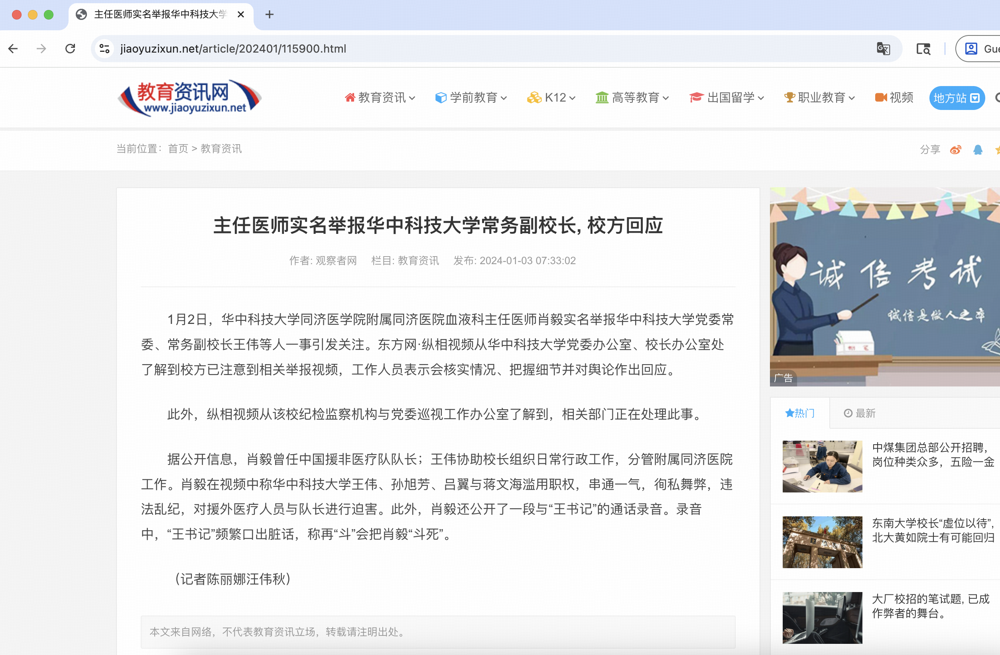

# 王伟 - 2025年中国科学院院士候选人

## 📋 基本信息

<table>
<tr>
<td width="60%" align="center">

</td>
<td width="40%">

|         **项目**          |               **内容**                |
|:-----------------------:|:-----------------------------------:|
|         **姓名**          |                 王伟                  |
|        **任职单位**         |          华中科技大学同济医学院附属同济医院          |
|         **评选**          |            2025年中国科学院院士             |
|      **负面舆情评估总分**       |                -9 分                 |
|       **负面舆情排名**        |                  5                  |
| **可信度 （含实名举报/官方处分）** |                 ✅ 是                 |
|        **学术不端**         |             -5 分 🔴 严重              |
|        **师风师德**         |             -4 分 🔴 严重              |
|        **经济腐败**         |                 0 分                 |
|       **负面舆情总结**        |  将“致谢论文”列为学术代表作；被实名举报后滥用职权迫害同事  |

</td>
</tr>
</table>

---

## 🔭 舆情总结

王伟作为2025年中国科学院院士候选人，在网络舆情中存在较大争议。主要问题集中在以下两个方面：

| 问题类别 | 评分 | 严重程度  |
|:---:|:---:|:-----:|
| 学术不端 | -5 | 🔴 严重 |
| 师风师德 | -4 | 🔴 严重 |
| 经济腐败 | 0 |  无问题  |

---

### 📚 学术不端问题

|       项目       | 详情                                       |
|:--------------:|:-----------------------------------------|
| **评分（满分 -5分）** | -5 分                                      |
|     **总结**     | 将致谢论文列为代表作，涉嫌学术不端                     |
|     **详情**     | 根据文学城博客的质疑，王伟在其简历中列出了一篇Science论文，但质疑者指出这项研究实际上是在美国Rochester大学完成的，所有作者均是Rochester的研究人员，王伟仅在文后的被致谢人员中出现，但却将此列为自己的"代表性论文"。质疑者认为"将致谢人列为作者，王伟院长这'代表性论文'可以说是举世无双"。 |

### 👥 师风师德问题

|       项目       | 详情                                       |
|:--------------:|:-----------------------------------------|
| **评分（满分 -5分）** | -4 分                                      |
|     **总结**     | 被举报滥用职权迫害同事，通话中频繁使用脏话                     |
|     **详情**     | 2024年1月，华中科技大学同济医学院附属同济医院血液科主任医师肖毅实名举报王伟等人滥用职权，串通一气，徇私舞弊，违法乱纪，对援外医疗人员与队长进行迫害。肖毅还公开了一段与"王书记"的通话录音，录音中"王书记"频繁口出脏话。 |

### 💰 经济腐败问题

|       项目       | 详情                                       |
|:--------------:|:-----------------------------------------|
| **评分（满分 -5分）** | 0 分                                      |
|     **总结**     | 无                     |
|     **详情**     | 无 |

---

## 📎 证据材料

### 图片证据

#### 证据1 

#### 证据2

#### 证据3 

#### 证据4 

#### 证据5 

### 信息来源:

1. 🔗 [文学城博客相关文章](https://blog.wenxuecity.com/myblog/61002/202508/16885.html)
2. 🔗 [文学城论坛讨论](https://bbs.wenxuecity.com/mychina/1045213.html)
3. 🔗 [文学城博客分析文章](https://blog.wenxuecity.com/myblog/61002/202010/10761.html)
4. 🔗 [推特相关爆料](https://x.com/POMTQ/status/1770038756646514941)
5. 🔗 [教育资讯网报道](https://www.jiaoyuzixun.net/article/202401/115900.html)
 
---

## 提示

> 
> 1. 本文档所有信息均来自互联网公开资料
> 2. 内容仅供参考，不代表任何官方立场
> 3. 如有错误或补充，请联系：topscifuture@outlook.com
> 4. 本文档不构成对任何个人的诽谤或人身攻击
> 5. 最终评选结果以官方公布为准