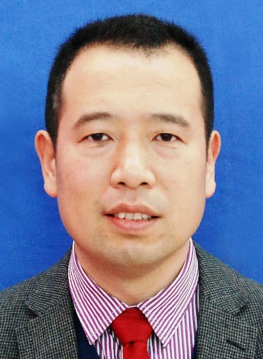
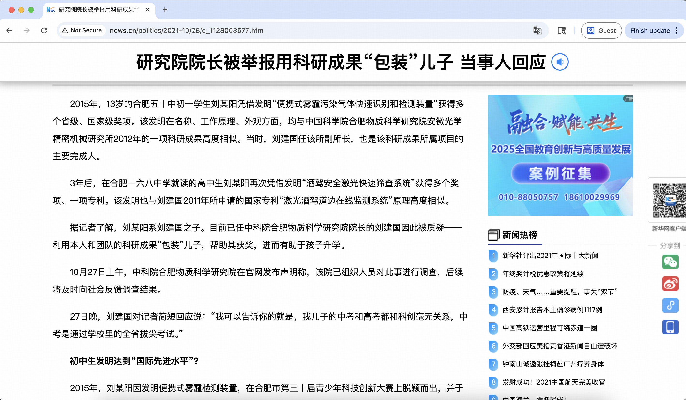
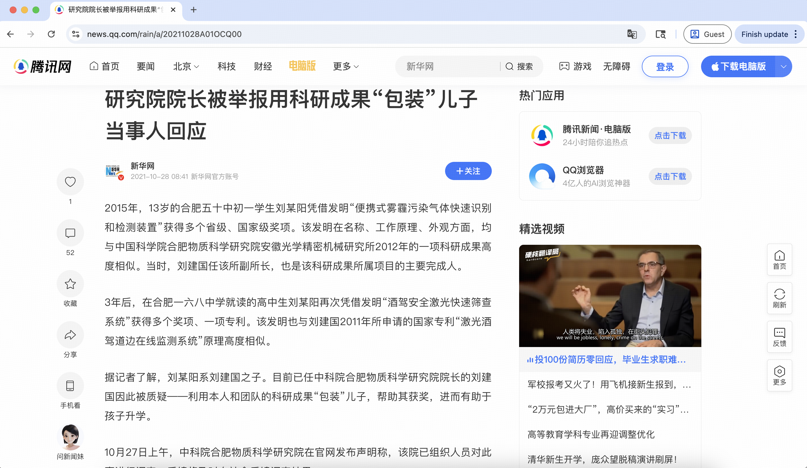
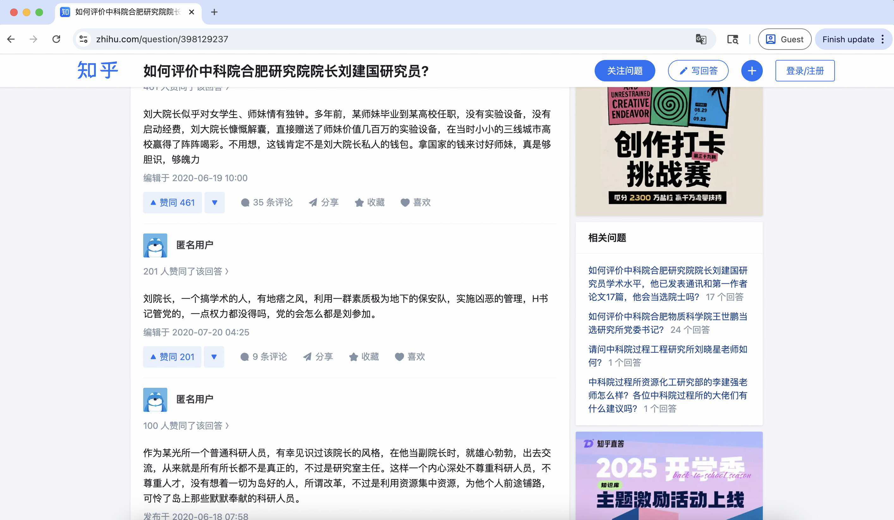
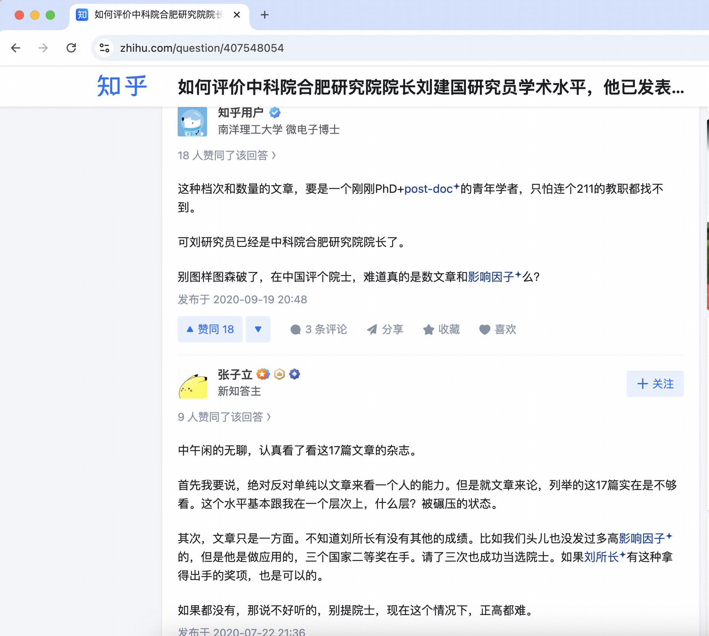

# 刘建国 - 2025年中国工程院院士候选人

## 📋 基本信息

<table>
<tr>
<td width="60%" align="center">

</td>
<td width="40%">

|         **项目**          |           **内容**            |
|:-----------------------:|:---------------------------:|
|         **姓名**          |             刘建国             |
|        **任职单位**         |       中国科学院合肥物质科学研究院        |
|         **评选**          |        2025年中国工程院院士         |
|      **负面舆情评估总分**       |            -6 分             |
|       **负面舆情排名**        |              6              |
| **可信度 （含实名举报/官方处分）** |             ✅ 是             |
|        **学术不端**         |             0 分             |
|        **师风师德**         |         -4 分 🔴 严重          |
|        **经济腐败**         |         -2 分 🟡 中等          |
|       **负面舆情总结**        | ”祖传科研“用科研成果帮助儿子获奖、挪用经费给"师妹" |

</td>
</tr>
</table>

---

## 🔭 舆情总结

刘建国作为2025年中国工程院院士候选人，在网络舆情中存在较大争议。主要问题集中在以下三个方面：

| 问题类别 | 评分 | 严重程度 |
|:---:|:---:|:---:|
| 学术不端 | 0 | 🟢 无/轻微 |
| 师风师德 | -4 | 🔴 严重 |
| 经济腐败 | -2 | 🟡 中等 |

---

### 📚 学术不端问题

|       项目       | 详情                                       |
|:--------------:|:-----------------------------------------|
| **评分（满分 -5分）** | 0 分                                      |
|     **总结**     | 论文数量和质量达不到高校教师资格                     |
|     **详情**     | 有观点认为刘建国发表的17篇通讯作者和第一作者SCI论文在档次和数量上存在不足，"这种档次和数量的文章，要是一个刚刚PhD+post-doc的青年学者，只怕连个211的教职都找不到"。搜索结果中未发现关于刘建国本人论文撤稿的具体信息。 |

### 👥 师风师德问题

|       项目       | 详情                                       |
|:--------------:|:-----------------------------------------|
| **评分（满分 -5分）** | -4 分                                      |
|     **总结**     | 用团队科研成果帮助儿子获多个国家级奖项                     |
|     **详情**     | 刘建国被举报利用本人和团队的科研成果"包装"儿子，帮助其获奖。2015年其儿子刘某阳凭借发明获得多个省级、国家级奖项，该发明在名称、工作原理、外观方面，均与中科院合肥物质科学研究院安徽光学精密机械研究所2012年的一项科研成果高度相似。2018年其儿子再次获奖的发明也与刘建国2011年所申请的国家专利原理高度相似。刘某阳的高中任课老师证实，该发明在研究过程中确实得到了刘某阳父亲刘建国的指导和帮助，属于"大手拉小手"。 |

### 💰 经济腐败问题

|       项目       | 详情                                       |
|:--------------:|:-----------------------------------------|
| **评分（满分 -5分）** | -2 分                                      |
|     **总结**     | 挪用国家经费给"师妹"                     |
|     **详情**     | 有网络传言称刘建国"似乎对女学生、师妹情有独钟"，曾"直接赠送了师妹价值几百万的实验设备"，质疑其"拿国家的钱来讨好师妹"。 |

---

## 📎 证据材料

### 图片证据

#### 证据1 

#### 证据2

#### 证据3 

#### 证据4 

### 信息来源:

1. 🔗 [知乎相关讨论](https://www.zhihu.com/question/407548054)
2. 🔗 [新华网报道](http://www.news.cn/politics/2021-10/28/c_1128003677.htm)
3. 🔗 [腾讯新闻报道1](https://news.qq.com/rain/a/20211028A01OCQ00)
4. 🔗 [腾讯新闻报道2](https://news.qq.com/rain/a/20211027A0ASYS00)
5. 🔗 [知乎相关讨论2](https://www.zhihu.com/question/398129237)
 
---

## 提示

> 
> 1. 本文档所有信息均来自互联网公开资料
> 2. 内容仅供参考，不代表任何官方立场
> 3. 如有错误或补充，请联系：topscifuture@outlook.com
> 4. 本文档不构成对任何个人的诽谤或人身攻击
> 5. 最终评选结果以官方公布为准