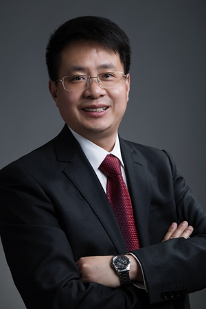
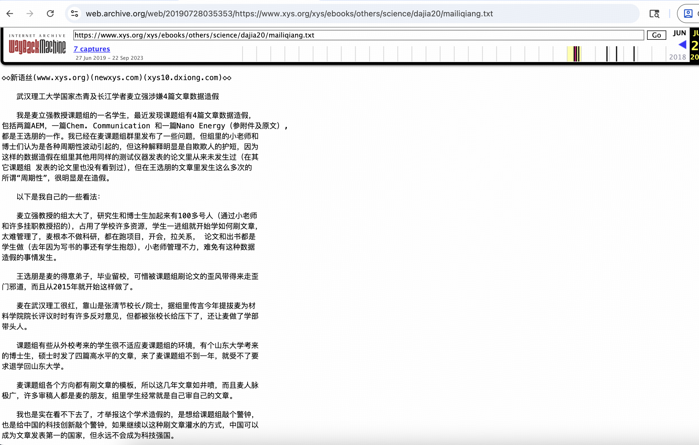
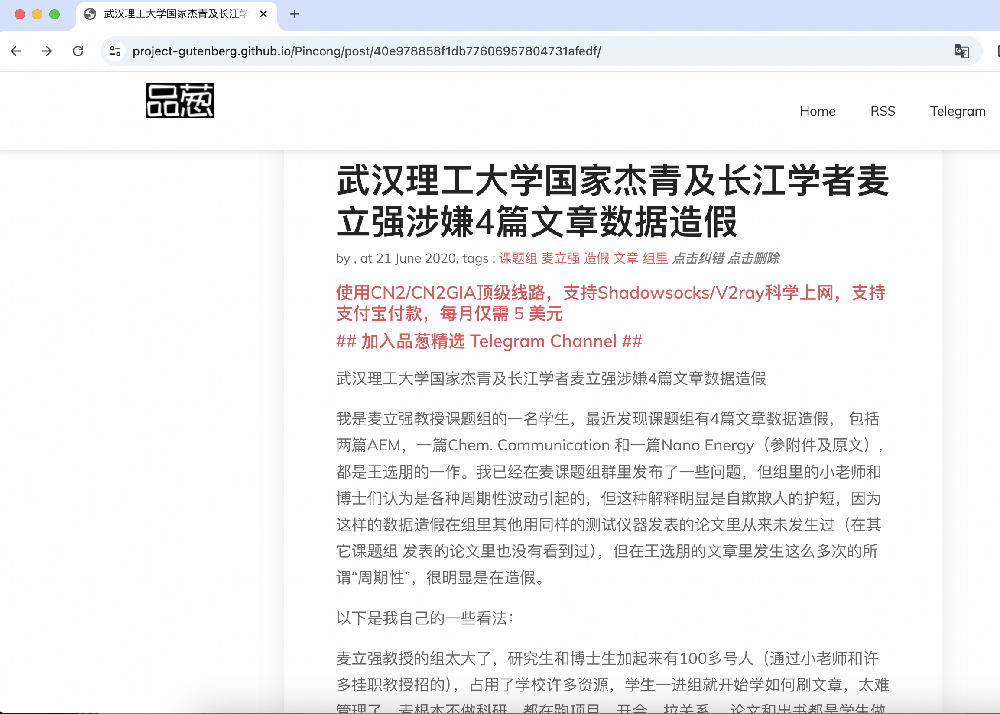
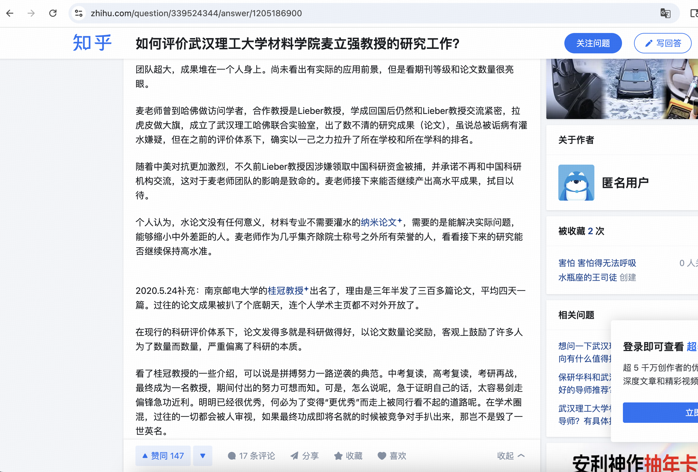

# 麦立强 - 2025年中国科学院院士候选人

## 📋 基本信息

<table>
<tr>
<td width="60%" align="center">

</td>
<td width="40%">

|         **项目**          |        **内容**        |
|:-----------------------:|:--------------------:|
|         **姓名**          |          麦立强         |
|        **任职单位**         |        武汉理工大学        |
|         **评选**          |     2025年中国科学院院士     |
|      **负面舆情评估总分**       |         -8 分         |
|       **负面舆情排名**        |           7          |
| **可信度 （含实名举报/官方处分）** |          ✅ 是         |
|        **学术不端**         |      -5 分 🔴 严重      |
|        **师风师德**         |      -3 分 🟡 中等      |
|        **经济腐败**         |        0 分         |
|       **负面舆情总结**        | 科研“灌水大王”，论文数据造假、多名学生被压榨至退学 |

</td>
</tr>
</table>

---

## 🔭 舆情总结

麦立强作为2025年中国科学院院士候选人，在网络舆情中存在较大争议。主要问题集中在以下三个方面：

| 问题类别 | 评分 | 严重程度 |
|:---:|:---:|:---:|
| 学术不端 | -5 | 🔴 严重 |
| 师风师德 | -3 | 🟡 中等 |
| 经济腐败 | 0 | 🟢 无 |

---

### 📚 学术不端问题

|       项目       | 详情                                       |
|:--------------:|:-----------------------------------------|
| **评分（满分 -5分）** | -5 分                                      |
|     **总结**     | 论文数据造假，科研灌水                               |
|     **详情**     | 有举报称麦立强课题组存在4篇文章数据造假，包括两篇AEM，一篇Chem. Communication和一篇Nano Energy。举报者指出"麦立强教授的组太大了，研究生和博士生加起来有100多号人，占用了学校许多资源，学生一进组就开始学如何刷文章，太难管理了，麦根本不做科研，都在跑项目，开会，拉关系"。在知乎上有评价称"团队超大，成果堆在一个人身上。尚未看出有实际的应用前景，但是看期刊等级和论文数量很亮眼"。 |

### 👥 师风师德问题

|       项目       | 详情                                       |
|:--------------:|:-----------------------------------------|
| **评分（满分 -5分）** | -3 分                                      |
|     **总结**     | 压榨学生写书，导致学生退学                           |
|     **详情**     | 有举报称"课题组有些从外校考来的学生很不适应麦课题组的环境，有个山东大学考来的博士生，硕士时发了四篇高水平的文章，来了麦课题组不到一年，就受不了要求退学回山东大学"。举报称"论文和出书都是学生做（去年因为写书的事还有学生抱怨）"。目前未搜索到关于麦立强个人性骚扰等师德问题的相关报道。 |

### 💰 经济腐败问题

|       项目       | 详情                                       |
|:--------------:|:-----------------------------------------|
| **评分（满分 -5分）** | 0 分                                       |
|     **总结**     | 无                                        |
|     **详情**     | 无                                        |

---

## 📎 证据材料

### 图片证据

#### 证据1 

#### 证据2

#### 证据3 

#### 证据4 
无

### 信息来源:

1. 🔗 [新语丝相关举报](https://web.archive.org/web/20190728035353/https://www.xys.org/xys/ebooks/others/science/dajia20/mailiqiang.txt)
2. 🔗 [品葱网讨论](https://project-gutenberg.github.io/Pincong/post/40e978858f1db77606957804731afedf)
3. 🔗 [知乎评价](https://www.zhihu.com/question/339524344/answer/1205186900)
 
---

## 提示

> 
> 1. 本文档所有信息均来自互联网公开资料
> 2. 内容仅供参考，不代表任何官方立场
> 3. 如有错误或补充，请联系：topscifuture@outlook.com
> 4. 本文档不构成对任何个人的诽谤或人身攻击
> 5. 最终评选结果以官方公布为准