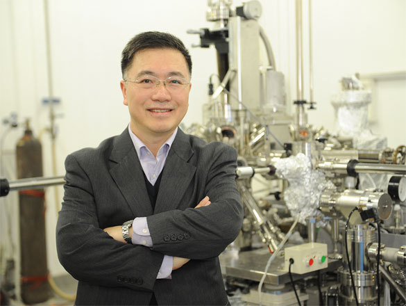
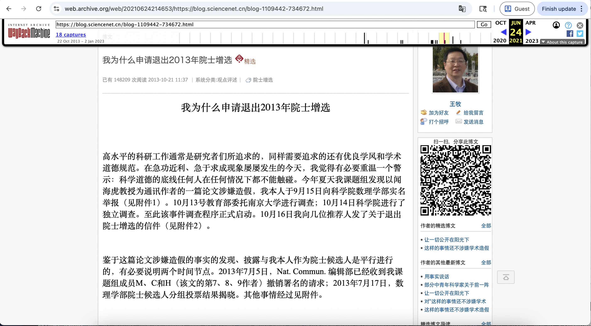
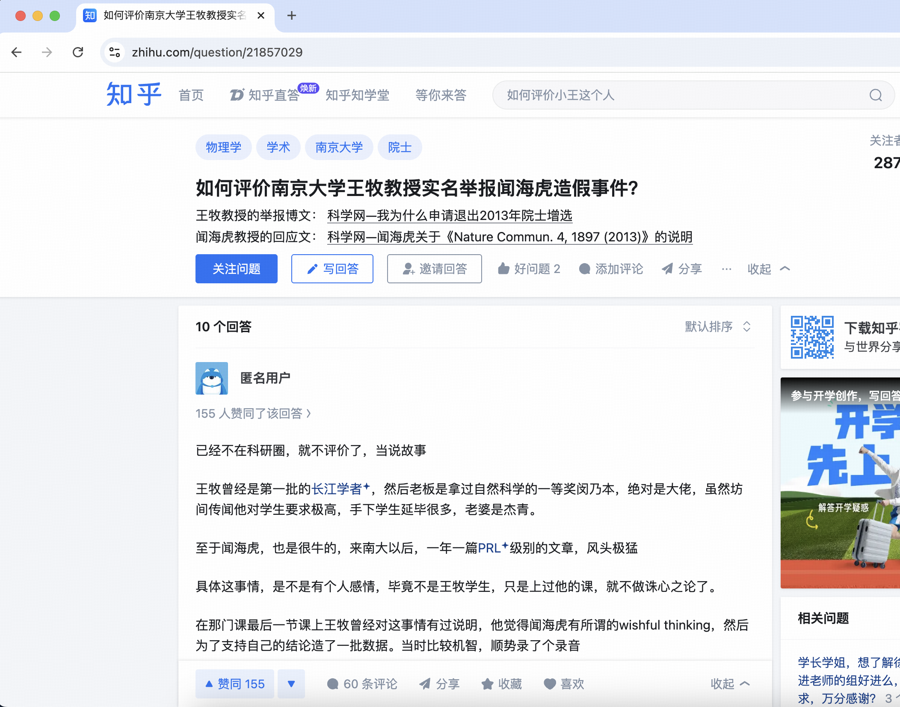
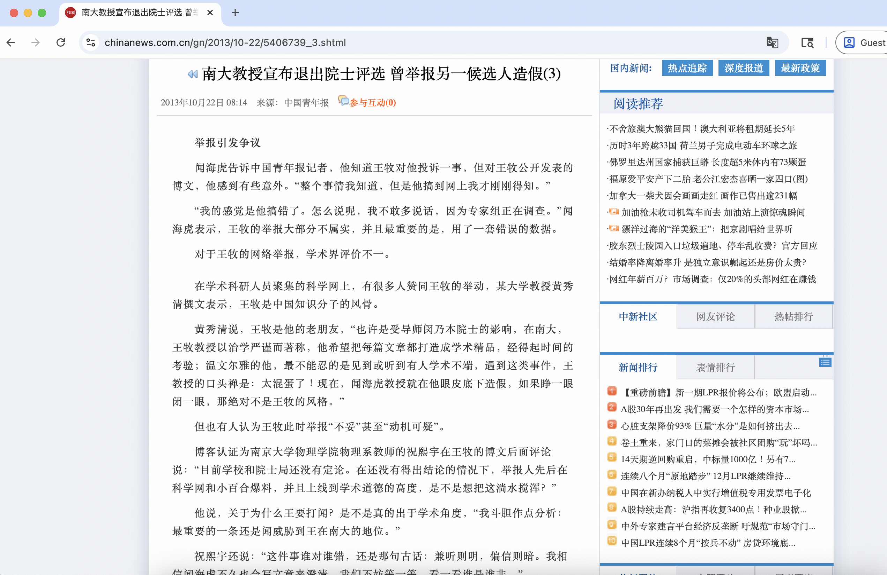
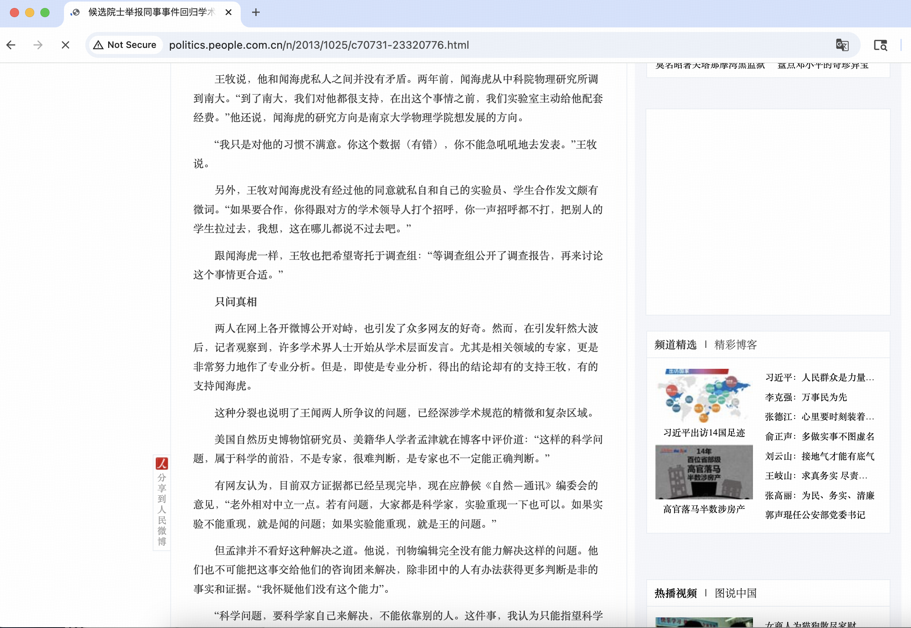

# 闻海虎 - 2025年中国科学院院士候选人

## 📋 基本信息

<table>
<tr>
<td width="60%" align="center">

</td>
<td width="40%">

|         **项目**          |      **内容**      |
|:-----------------------:|:----------------:|
|         **姓名**          |       闻海虎        |
|        **任职单位**         |       南京大学       |
|         **评选**          |   2025年中国科学院院士   |
|      **负面舆情评估总分**       |       -8 分       |
|       **负面舆情排名**        |        8         |
| **可信度 （含实名举报/官方处分）** |       ✅ 是        |
|        **学术不端**         |    -5 分 🔴 严重    |
|        **师风师德**         |    -3 分 🟡 中等    |
|        **经济腐败**         |       0 分        |
|       **负面舆情总结**        |  被实名举报论文造假、随意“支使”他人学生   |

</td>
</tr>
</table>

---

## 🔭 舆情总结

闻海虎作为2025年中国科学院院士候选人，在网络舆情中存在较大争议。主要问题集中在以下三个方面：

| 问题类别 | 评分 | 严重程度  |
|:---:|:---:|:-----:|
| 学术不端 | -5 | 🔴 严重 |
| 师风师德 | -3 | 🟡 中等 |
| 经济腐败 | 0 |   无   |

---

### 📚 学术不端问题

|       项目       | 详情                                       |
|:--------------:|:-----------------------------------------|
| **评分（满分 -5分）** | -5 分                                      |
|     **总结**     | 编造论文数据，涉嫌学术造假                     |
|     **详情**     | 2013年王牧教授实名举报闻海虎在Nature Communications发表的论文涉嫌造假。举报内容称闻海虎存在"wishful thinking"，为支持自己的结论造了一批数据。王牧举报称闻海虎论文中的数据经过处理，接下来推导出的数据之间的关联是"编造的"。具体指控包括在从未进行过能谱测量的样品区域随手标上不同颜色的点，声称进行过化学成分测量。 |

### 👥 师风师德问题

|       项目       | 详情                                       |
|:--------------:|:-----------------------------------------|
| **评分（满分 -5分）** | -3 分                                      |
|     **总结**     | 未经同意，压榨他人学生干活                     |
|     **详情**     | 根据王牧的举报，闻海虎没有经过他的同意就私自和自己的实验员、学生合作发文，王牧认为"如果要合作，你得跟对方的学术领导人打个招呼，你一声招呼都不打，把别人的学生拉过去，这在哪儿都说不过去"。 |

### 💰 经济腐败问题

|       项目       | 详情                                       |
|:--------------:|:-----------------------------------------|
| **评分（满分 -5分）** | 0 分                                      |
|     **总结**     | 无                     |
|     **详情**     | 无经济腐败相关问题 |

---

## 📎 证据材料

### 图片证据

#### 证据1 

#### 证据2

#### 证据3 

#### 证据4 

#### 证据5 

### 信息来源:

1. 🔗 [知乎相关讨论](https://www.zhihu.com/question/21857029)
2. 🔗 [中国教育网王牧专题](https://www.edu.cn/html/rd/wangmu/)
3. 🔗 [中国新闻网报道](https://www.chinanews.com.cn/gn/2013/10-22/5406739_3.shtml)
4. 🔗 [人民网报道](http://politics.people.com.cn/n/2013/1025/c70731-23320776.html)
5. 🔗 [观察者网报道](https://www.guancha.cn/TMT/2013_10_22_180226.shtml)
 
---

## 提示

> 
> 1. 本文档所有信息均来自互联网公开资料
> 2. 内容仅供参考，不代表任何官方立场
> 3. 如有错误或补充，请联系：topscifuture@outlook.com
> 4. 本文档不构成对任何个人的诽谤或人身攻击
> 5. 最终评选结果以官方公布为准